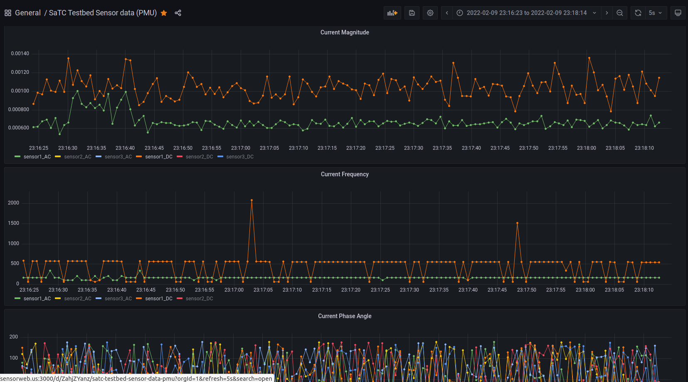
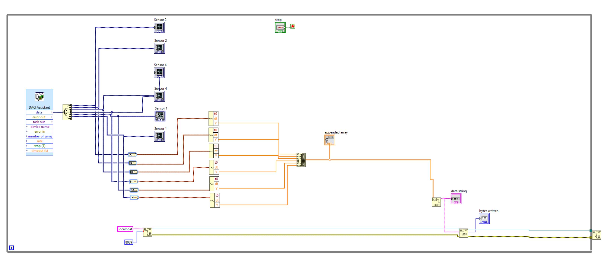

# NI device sensor data acquisition
A python script to acuire the data from NI device then uploading to the InfluxDB.

## Usage:
Uploading data:

```python3 NI_upload_PMU.py```

Downloading data example:
Please reference the ```data_download.py```, which downloads the data in the InfluxDB and save to a CSV file.

## Visualization:
```grafanaPanel.json``` is the configuration file for Grafana. Import this JSON file would generate the same Grafana panel as below. The panel is showing below:



## LabView diagram:
The following pic shows the diagram of the LabView setting. We send the sensor data into the TCP port.


