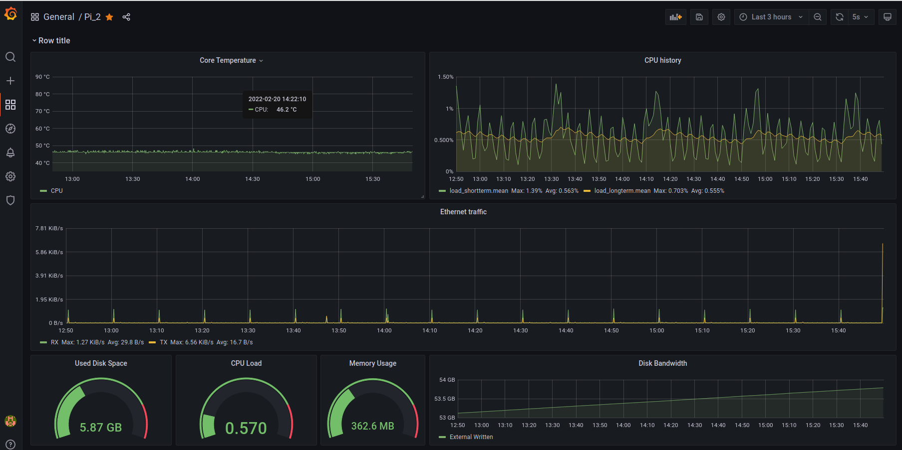

# Launch ssh attack to the raspberry pi mesh network
A program to launch the ssh stepstone attack to the raspberry Pi mesh network, which would affect the energy consumption of Pis. By analyzing those data, we could detect the potential vulnerabilities of Raspberry Pis.

We use **collectd** to collect those energy consumption data and push to the InfluxDB. Eventually using Grafana to visuliaze the data.
```grafanaPanel.json``` is the configuration file for Grafana. Import this JSON file would generate the same Grafana panel as below.

## Usage:
```bash
cd main_PC
chmod a+x scan_attack.sh

# The arguments are the victims' IP addresses of the stepstone attack. The number is arbitrary.
./scan_attack.sh ip1 ip2 ip3 ip4

# Control the motor without stepstone attack
# python publisher.py motor_nubmer command_number
# e.g. spin the motor 1:
python publisher.py 1 5

# Motorboard Commands:
# 0 - Stop Motor
# 1 - Speed Up Motor (40 rad/s per increase)
# 2 - Slow Down Motor (40 rad/s per decrease)
# 3 - Stop Motor & Turn off program (light switches from blue to green)
# 4 - Clear Faults
# 5 - Make connection, turn on program (light switches from green to blue), and start motor in default mode (speed 70 rads/s)
# 6 - Stop Motor, Turn off program, stop/break connection to board.
```

## An example of Grafana panel
This screenshot showing an example of Grafana panel of a Raspberry Pi's energy consumption.

## Notes:
Before launching the attack, please make sure to save the public keys from different Pis into every Pi's known host file, which locates in the directory ```~/.ssh/known_hosts```.